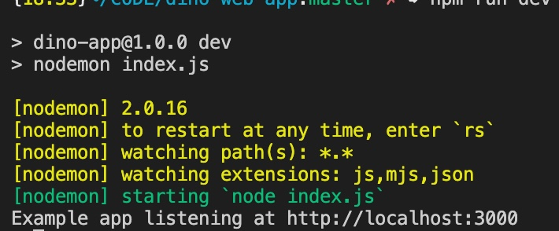

# Dinosaur Generator App!

## This Web-app is to get More Familiar with Node.js/Express

### What This app Does

Each time the button is pressed a dinosaur name from the text api will be displayed randomly. Then an image will be displayed randomly under that name.

### Instructions to run Code on Your own Machine

1. Have `npm` installed: run `npm install -g npm` use `npm -v` to check which version you are on
2. In [package.json](package.json) under `scripts` we add `dev: nodemon index.js`. This is for running the server automatically after each change.
3. Install express: run `npm install express`
4. Install nodemon: `npm install nodemon --save-dev`
5. Next you want to make sure you have Node up-to-date, check using `node --version`.
6. You can download `nvm` as an easy way to switch between different nodes. [nvm github](https://github.com/nvm-sh/nvm)
7. You can also just download to the latest version if you don't want to use nvm:  
   1. `sudo npm cache clean -f`
   2. `sudo npm install -g n`
   3. `sudo n stable`
8. Everything should be up-to-date now. Go ahead in directory of `index.js` and run `npm run dev`. You should see something like this: 
9. You will need to create an `.env` file and have one line of text with `API_KEY=` followed by the api-key
10. [Using Rapid API](https://rapidapi.com/microsoft-azure-org-microsoft-cognitive-services/api/bing-image-search1/)
    1.  Pick image search
    2.  In the **required parameters** under q String; type the word **dinosaur**
    3.  Under **count input** type in 10. This is the number I tested with.
11. Now use the **X-RapidAPI-Key** and place that in your `.env` file.
12. Now you should be able to run `npm run dev` again and now when the button is clicked images will be displayed.

## Updated Code Instructions

The above instructions will still work for local deployment, but this code has been updated to be ran on a AWS server on a website in production. We now use docker for deployment of this code.

This was done because it's incredibly easier to deploy using docker instead of doing all these steps for each deployment. However, I have not figured out how to just update the existing docker container/image and I always delete and re-compile the image/container.

### Example of Building the Docker Image and Container

``` docker 
# Build dino app
docker build . -t zachmuzzle/dino-web-app
# Fixes permission error
sudo chmod 666 /var/run/docker.sock
# runs docker app on server 49160. -d means runs in background
docker run -i -t -p 49160:3000 -d zachmuzzle/dino-web-app
#Kill an image that won't stop
docker exec -it <container> kill 1
#Rebuild
docker-compose up --force-recreate --build -d
docker image prune -f
#Kill images/container
sudo systemctl restart docker.socket docker.service
# Removes all images
sudo docker image rm -f $(sudo docker image ls -q)
```
If this is your first time building using docker... Then you will only need to do the first 3 prompts.
If you're rebuilding the docker image/container you will need to kill the image and rebuild *you may have to not rebuild under the **#Rebuild** section above and just kill and remove all images and containers. Then rebuild like before.* (I still haven't figured out how to successfully update the docker piece)
